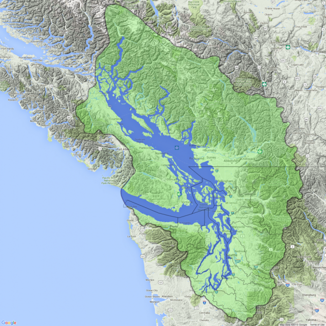

# The Authors

The Salish Sea Cadre consists of systems thinkers, practical theorists, and advocates for community-led resilience. With backgrounds in entrepreneurship, engineering, and sustainable systems design, the cadre's work focuses on creating actionable frameworks that empower groups to build autonomous, self-sufficient, and equitable futures.

[Crisis Cadres](cadres/what-is-a-cadre.md) is the culmination of years of research and hands-on experimentation, offering a pragmatic roadmap for anyone who believes that the best way to predict the future is to build it ourselves.

---

**[Start a discussion](https://github.com/crisis-cadres/praxis-hub/issues/new?title=The%20Authors)** · [View discussions](https://github.com/crisis-cadres/praxis-hub/issues) · [Edit this page](https://github.com/crisis-cadres/praxis-hub/edit/main/wiki/docs/salish-sea-cadre.md)
